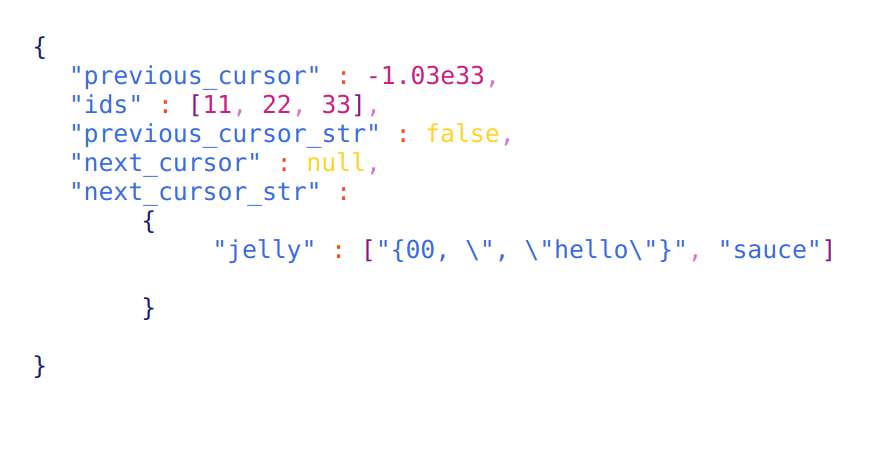

# Golang formatter and colorizer

Takes json file input and returns colorized and formatted html output.

Running:
go run format.go <file.json> > formated.html 
(open html file in web browser to see)

input of sample json file:
{"previous_cursor": -1.03e33,"ids": [11,22,33],"previous_cursor_str": false,"next_cursor": null,"next_cursor_str": {"jelly": ["{00, \", \"hello\"}", "sauce"] }
}

Picture of sample output:

